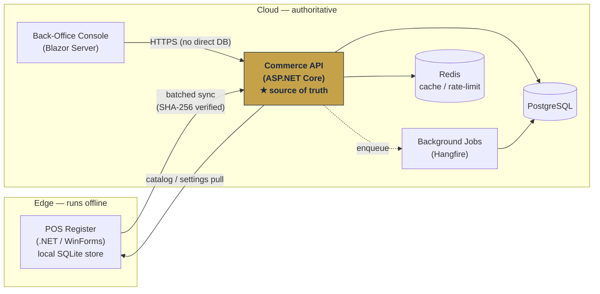

# Euphomax Commerce — Engineering Showcase

> An offline-first, multi-tenant **commerce operating system** — a point-of-sale platform where every sale is permanently linked to its payment, its stock movement, and its cloud record, even when the internet isn't.

This repository is a **curated public showcase** of a larger private system. It exists to demonstrate engineering depth — architecture, correctness under failure, and code quality — not to be a runnable product. See [What this repo is (and isn't)](#what-this-repo-is-and-isnt).

---

## The problem it solves

Retail and wholesale operators in many markets — and acutely across Africa, where the platform is focused first — run their businesses under conditions most commerce software quietly assumes away:

- **Intermittent connectivity.** The internet drops for minutes or days. A till that can't sell when the link is down is useless.
- **Power volatility.** Terminals lose power mid-transaction and must come back up with zero data loss.
- **Mixed payments.** Cash, cards, bank transfers, and mobile money all coexist in a single day's takings.
- **Multi-branch, multi-currency reality.** One owner may run several locations, sometimes across borders and currencies.

Euphomax is built so the **point of sale keeps running for up to 30 days fully offline**, then reconciles every transaction to an authoritative cloud once a connection returns — without duplicates, without losing money, and without trusting a tampered client. The architecture is currency-, culture-, and tax-agnostic, so the same platform deploys globally.

---

## Key features

- **Offline-first POS.** The desktop register runs on a local store (SQLite) and operates indefinitely without connectivity, syncing opportunistically with exponential backoff.
- **Closed-loop transactions.** Sale → payment → stock movement → cloud record are one connected event, not four systems stitched together after the fact.
- **Multi-tenant isolation.** Every tenant's data is fenced off at the database level by global query filters, with a single audited super-admin bypass for the vendor control plane.
- **Real-time back-office.** A browser-based management console (Blazor Server) gives owners inventory, staff, pricing, and analytics from anywhere — and never processes sales itself.
- **Role-based access control & tier gating.** Features, register counts, and permissions are governed by a three-tier subscription model.
- **Comprehensive payments.** Cash, cards, bank transfers, and mobile money are first-class at every tier; mobile money is one method among many, not the whole story.
- **Tenant-sovereign localization.** Currency, ISO code, decimal precision, culture, time zone, and tax profiles are per-tenant configuration — never hardcoded.

---

## Architecture at a glance

A **separation-of-powers** design: each surface has exactly one job, and the API is the single source of truth that reconciles everything.

**Rules the diagram encodes:**
- The **POS executes** sales and syncs; it cannot manage inventory or prices.
- The **back-office decides** (inventory, pricing, staff, analytics); it cannot process a sale.
- The **API coordinates** — it enforces every business rule, resolves conflicts, and is the only path to business logic and data. The back-office never touches the database directly.

A deeper write-up lives in [`docs/ARCHITECTURE.md`](docs/ARCHITECTURE.md).

---

## Tech stack

| Layer | Technology |
|-------|-----------|
| Language / runtime | C# on .NET 8 |
| API | ASP.NET Core (REST, cookie + JWT auth, rate limiting) |
| Data access | Entity Framework Core 8 |
| Cloud database | PostgreSQL (xmin optimistic concurrency) |
| Edge database | SQLite (local POS store) |
| Cache / rate limiting | Redis (StackExchange.Redis) |
| Background jobs | Hangfire (PostgreSQL storage) |
| Realtime | SignalR |
| Back-office UI | Blazor Server |
| POS UI | WinForms (.NET desktop) |
| Mapping / validation | AutoMapper · FluentValidation |
| Containerization | Docker |
| CI/CD | GitHub Actions (multi-job, zero-warning gate, contract diffing) |

---

## Engineering highlights

These are the parts worth opening the code for:

- **Offline-first sync with integrity verification.** Each sale carries a **SHA-256 hash** computed from a canonical formula shared verbatim by the edge and the server. On sync, the server recomputes it over the byte-for-byte payload, so any item-level tampering (quantity, price, tax) is caught before a write.
  → [`SaleIntegrityUtility.cs`](src/BMS.Shared/Utilities/SaleIntegrityUtility.cs) · [`SyncService.SaleSync.cs`](src/BMS.Services/Services/SyncService.SaleSync.cs)

- **Idempotent, cloud-authoritative reconciliation.** The sale **GUID is the authoritative identity**; the human-readable receipt number is only a display key. Re-pushing the same sale is a silent no-op; a receipt number reused under a *different* GUID is a terminal conflict that's dead-lettered rather than retried forever. A sale that physically happened at the till always settles.
  → [`SyncService.SaleSync.cs`](src/BMS.Services/Services/SyncService.SaleSync.cs) · proven by [`SyncIdempotencyTests.cs`](src/BMS.IntegrationTests/Tests/SyncIdempotencyTests.cs)

- **Zero-trust edge validation.** Before any write, the server verifies the register exists, that its branch matches the payload, and that the authenticated user's branch agrees — defeating cross-branch injection even with a manipulated client.
  → [`SyncService.SaleSync.cs`](src/BMS.Services/Services/SyncService.SaleSync.cs)

- **Decimal-precise money.** All monetary values are `decimal` (`decimal(18,2)`); quantities are `decimal(18,3)` to support weighed/loose goods. `float`/`double` are never used for money — rounding error is treated as a financial bug.
  → [`Sale.cs`](src/BMS.Core/Entities/Sale.cs) · [`SaleItem.cs`](src/BMS.Core/Entities/SaleItem.cs)

- **Multi-tenant isolation as a schema property.** Every tenant-scoped entity gets the same global query filter, so isolation doesn't depend on a developer remembering a `WHERE` clause. `TenantId` is stamped automatically on insert.
  → [`ApplicationDbContext.MultiTenancy.cs`](src/BMS.Data/ApplicationDbContext.MultiTenancy.cs)

- **Server-side everything for reads.** Filtering, counting, ordering, and paging are all translated to SQL via composable `IQueryable` extensions — rows are never pulled into memory and then filtered.
  → [`QueryableExtensions.cs`](src/BMS.Data/Extensions/QueryableExtensions.cs) · [`SalesService.Query.cs`](src/BMS.Services/Services/SalesService.Query.cs)

- **Integration tests against real PostgreSQL.** The sync guarantees are regression-locked by tests that run against an actual PostgreSQL container (not an in-memory fake), because the behavior being tested — unique constraints, concurrency, transactional rollback — only exists in the real engine.
  → [`SyncIdempotencyTests.cs`](src/BMS.IntegrationTests/Tests/SyncIdempotencyTests.cs)

- **Multi-job CI with a zero-warning policy.** Backend, desktop, and frontend build on every change; a single compiler warning fails the build (`/warnaserror`). An OpenAPI contract is generated and **diffed against a committed baseline** so a breaking API change blocks merge.
  → [`docs/ci-pipeline.yml`](docs/ci-pipeline.yml)

---

## Screenshots

> _Placeholders — add real captures here._

| POS register (offline sale) | Back-office dashboard | Sync health |
|---|---|---|
| _add `docs/images/pos.png`_ | _add `docs/images/backoffice.png`_ | _add `docs/images/sync.png`_ |

---

## What this repo is (and isn't)

**This is a curated subset, not the full system.** The production platform is a large multi-project solution. To prove engineering depth without exposing the entire proprietary codebase or sensitive business logic, this repo includes:

- A few **complete, representative files** (entities, validators, an API controller, query/index extensions, an integration test).
- A handful of **focused excerpts** of larger files, clearly marked at the top, where only the illustrative portion is reproduced and the rest is elided with `// … omitted` markers (e.g. the multi-tenancy slice of the `DbContext`, the single-sale path of the sync engine, one query method).

It is therefore **not buildable as-is** — there is no `.sln`, no full dependency graph, and no configuration. It is meant to be *read*. Every excerpt mirrors real production code; nothing here is a toy reimplementation.

**Deliberately excluded:** the marketing/storefront frontend, secrets and configuration of every kind, infrastructure/deployment scripts, and the bulk of the domain (purchasing, refunds, tax engine, vendor control plane, etc.).

---

## License & usage

The source in this repository is published **for evaluation and demonstration purposes only** — to let prospective collaborators and reviewers assess the engineering. It is **not licensed for reuse, redistribution, or production use.** See [`LICENSE`](LICENSE).

© Albert Owusu. All rights reserved.
